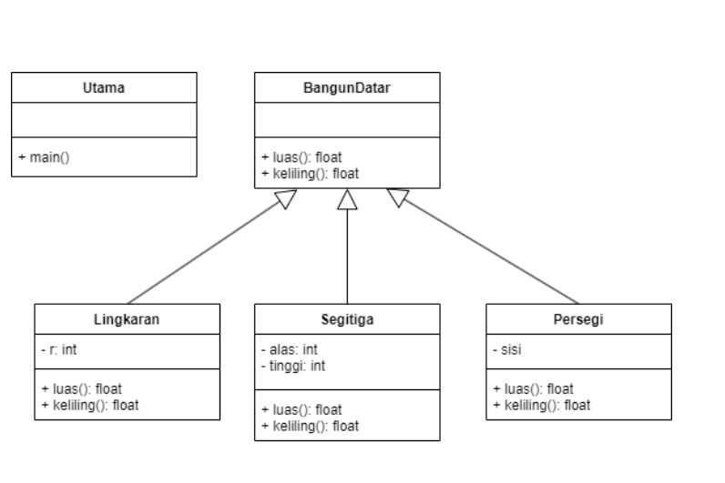

# Nama:  Yusdiansyah Andika Haryo Saputra
# Kelas: TI.23.A.6
# NIM:   312310650
&nbsp;

## Praktikum 4 OOP
&nbsp;

# Polymorph
Polymorphisme dalam Java adalah konsep dari pemrograman berorientasi objek (OOP) yang memungkinkan suatu objek untuk memiliki banyak bentuk. Ini adalah salah satu prinsip utama dalam OOP bersama dengan enkapsulasi, abstraksi, dan pewarisan. Dalam bahasa sederhana, polymorphisme memungkinkan metode yang sama untuk berperilaku berbeda tergantung pada objek yang memanggilnya.

&nbsp;

## Struktur Kelas

### 1. Bangun Datar
  Kelas abstrak yang mendefinisikan metode: luas() dan keliling().
  metode ini dapat diimplementasikan kepada kelas turunan (Lingkaran, Persegi, segitiga).

  ### Code 
  ```java
abstract  class bangundatar {
    public abstract float luas();
    public abstract float keliling();
}
```
&nbsp;

### Lingkaran
```java

public class lingkaran extends bangundatar{
    private double pi = Math.PI;
    private int r;

    public lingkaran(int r){
        this.r = r;
    }


    @Override
    public float luas(){
        return (float)  (pi * this.r * this.r);
    }

    @Override
    public float keliling(){
        return (float) (2 * pi * this.r);
    }
}
```
&nbsp;

### Persegi
```java

public class persegi extends bangundatar{
    private int sisi;

    public persegi(int sisi){
        this.sisi = sisi;
    }

    @Override
    public float luas(){
        return (float) (this.sisi * this.sisi);
    }

    @Override
    public float keliling(){
        return (float) (2 * this.sisi);
    }
    
}
```
&nbsp;

### Segitiga
```java

public class segitiga {
    private float alas,tinggi;

    public segitiga(int alas,int tinggi){
        this.alas = alas;
        this.tinggi = tinggi;
    }

    public float luas(){
        return (float) (0.5 * alas * tinggi);
    }
    public float keliling(){
        double sisimiring = Math.sqrt(alas * alas * tinggi * tinggi);
        return (float) (alas + tinggi + sisimiring);
    }
}
```

### 2.Main
  Program Utama untuk menjalankan program diatas

  ### Code
  ```java

public class main {
    public static void main(String[] args) {
        lingkaran Lingkaran = new lingkaran(8);
        persegi persegi = new  persegi(10);
        segitiga segitiga = new segitiga(10, 15);

        //Perhitungan masing-masing bangun datar
        System.out.println("Menghitung luas dan keliling Lingkaran");
        System.out.println("Luas Lingkaran: "+Lingkaran.luas());
        System.out.println("Keliiling Lingkaran: "+Lingkaran.keliling());
        System.out.println(" ");

        System.out.println("Menghitung luas dan keliling Persegi");
        System.out.println("Luas Persegi: "+persegi.luas());
        System.out.println("Keliiling persegi: "+persegi.keliling());
        System.out.println(" ");

        System.out.println("Menghitung luas dan keliling Segitiga");
        System.out.println("Luas Segitiga: "+segitiga.luas());
        System.out.println("Keliiling Segitiga: "+segitiga.keliling());
        System.out.println(" ");

    }
}
```
&nbsp;

### Hasil eksekusi


.png)
P.S Ignore the 17 problem in there, this file just doesn't know where they belongs to! 
